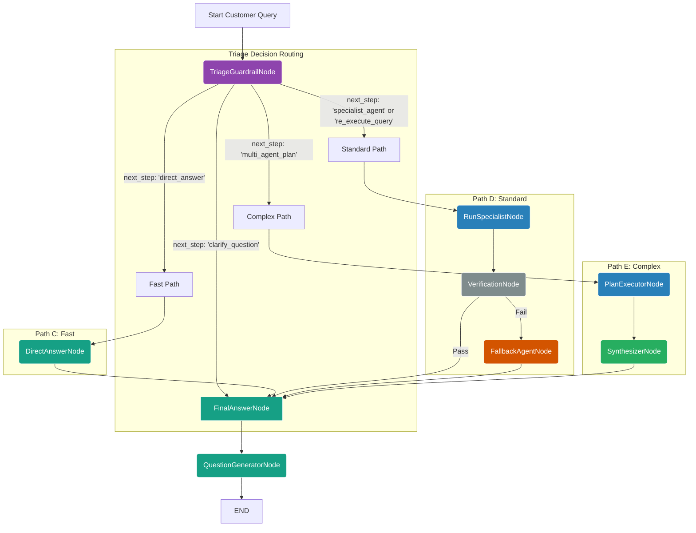

# CustomerWorkflow - Advanced Optimized Agentic System

## Overview

The **CustomerWorkflow** is a sophisticated, high-performance agentic workflow system designed specifically for authenticated customers. Based on the optimized `customer_workflow.py`, this workflow successfully combines intelligent triage-based routing with adaptive execution paths, robust security, enhanced memory management, and advanced **MCP (Model Context Protocol)** integration to deliver exceptional customer experiences.

## Analysis of the Optimized Customer Workflow

This is a well-architected and powerful implementation that represents the evolution from traditional linear agent chains to a modern, adaptive workflow system optimized for authenticated customer interactions.

### Key Strengths & Architectural Pillars

**1. Intelligent Adaptive Routing:**
The workflow employs a sophisticated triage system that classifies queries and selects optimal processing paths:
- **TriageGuardrailAgent:** Acts as the central intelligence hub, making routing decisions based on query complexity, domain requirements, and customer context
- **Fast Path Optimization:** Simple queries bypass complex processing chains, resulting in near-instant responses
- **Adaptive Complexity Handling:** Automatically scales processing complexity based on query requirements

**2. Enhanced Customer Experience:**
- **Streaming Responses:** Real-time response delivery with rich metadata and progress indicators
- **Memory Integration:** CacheManager and HistoryCache provide personalized, context-aware interactions
- **Sentiment Analysis:** Advanced emotion and intent understanding for better customer satisfaction
- **Suggested Questions:** Proactive engagement through intelligent follow-up question generation

**3. MCP Integration:**
- **Advanced Retrievers:** Leverages Model Context Protocol for efficient, standardized data retrieval
- **Centralized Tool Management:** MCPRetrieverFactory provides standardized creation and management
- **Enhanced Performance:** MCP tools offer superior performance and reliability over traditional retrievers
- **Scalable Architecture:** MCP servers enable distributed, scalable knowledge retrieval

**4. Robust Security & Access Control:**
- **Role-Based Access:** Customer-specific capabilities with tiered access levels (customer, premium_customer, vip_customer, admin)
- **Session Management:** Secure session handling with interaction tracking and privacy controls
- **Customer Context Awareness:** Personalized responses while maintaining data protection standards

**5. Performance & Scalability:**
- **Reduced LLM Calls:** Optimized from 4-5 LLM calls to maximum 3 calls for standard queries
- **Intelligent Caching:** Frequently requested information cached with TTL management
- **Resource Management:** Automatic connection cleanup and memory optimization
- **Error Isolation:** Agent failures don't cascade across the system

---

## Graph of the Optimized Customer Workflow

This Mermaid diagram visualizes the sophisticated flow and decision logic of the CustomerWorkflow system:



## Core Components

### Node Architecture

| Node | Agent | Purpose | Input | Output |
|------|-------|---------|-------|---------|
| `triage_node` | `TriageGuardrailAgent` | Query classification, complexity assessment, routing decisions | `original_query`, `chat_history`, `customer_context` | `classified_agent`, `next_step`, routing metadata |
| `direct_answer` | `DirectAnswerAgent` | Fast responses for simple queries and greetings | `original_query` | `agent_response` |
| `run_specialist` | Domain specialists | Execute domain-specific knowledge retrieval with customer context | `original_query`, `classified_agent`, `customer_id` | `agent_response`, `confidence_score` |
| `plan_executor` | Multiple specialists | Multi-agent coordination for complex customer queries | `original_query`, `agent_plan` | `agent_response` |
| `verification_node` | Built-in logic | Quality assurance, confidence validation, error detection | `agent_response`, `confidence_score` | `is_final_answer`, verification status |
| `fallback_agent` | `FallbackAgent` | Recovery responses for verification failures | `original_query`, `error_context` | `agent_response` |
| `synthesizer_node` | `SynthesizerAgent` | Aggregate and synthesize multi-agent results | Multiple agent responses | `synthesized_response` |
| `final_answer` | `FinalAnswerAgent` | Polish responses, format for streaming, add metadata | `agent_response`, `customer_context` | `final_response`, streaming events |
| `question_generator` | `QuestionGeneratorAgent` | Generate personalized follow-up questions | `agent_response`, `customer_history` | `suggested_questions` |

### Specialist Agents with MCP Tools

| Agent | Purpose | Traditional Tools | MCP Tools | Customer Access |
|-------|---------|------------------|-----------|-----------------|
| `CompanyAgent` | Company information retrieval | `company_retriever_tool` | `company_retriever_mcp_tool` | All customers |
| `CustomerAgent` | Customer service and support | Various customer tools | `customer_retriever_mcp_tool` | All customers |
| `ProductAgent` | Product specifications and details | `product_retriever_tool` | `product_retriever_mcp_tool` | All customers |
| `MedicalAgent` | Medical information and research | `medical_retriever_tool` | `medical_retriever_mcp_tool` | All customers |
| `DrugAgent` | Drug information and interactions | `drug_retriever_tool` | `drug_retriever_mcp_tool` | All customers |
| `GeneticAgent` | Genetic and genomic information | `genetic_retriever_tool` | `genetic_retriever_mcp_tool` | All customers |
| `DirectAnswerAgent` | Simple responses | `searchweb_tool` | None | All customers |
| `FallbackAgent` | Error recovery | `searchweb_tool`, `company_retriever_mcp_tool` | Multiple MCP tools | All customers |

### MCP (Model Context Protocol) Integration

The CustomerWorkflow leverages advanced MCP integration for superior data retrieval and processing:

#### MCP Retriever Factory

The workflow uses `MCPRetrieverFactory` for centralized MCP tool management:

```python
from app.agents.factory.mcp_retriever_factory import MCPRetrieverFactory

# Available MCP retriever types
mcp_types = {
    'company': 'Company documents and information retriever',
    'customer': 'Customer-specific documents retriever', 
    'product': 'Product catalog and information retriever',
    'medical': 'Medical and healthcare information retriever',
    'drug': 'Drug and pharmacological information retriever',
    'genetic': 'Genetic and biomedical information retriever'
}
```

#### MCP Tool Configuration

Each MCP tool is configured with specific parameters:

| MCP Tool | Collection | Watch Directory | Description |
|----------|------------|-----------------|-------------|
| `company_retriever_mcp_tool` | `company_knowledge` | `app/agents/retrievers/storages/companies` | Company documents and policies |
| `customer_retriever_mcp_tool` | `customer_docs` | `app/uploaded_files/documents` | Customer-specific documents |
| `product_retriever_mcp_tool` | `product_knowledge` | `app/agents/retrievers/storages/products` | Product specifications and catalogs |
| `medical_retriever_mcp_tool` | `medical_docs` | `app/agents/retrievers/storages/medical_docs` | Medical research and guidelines |
| `drug_retriever_mcp_tool` | `drug_knowledge` | `app/agents/retrievers/storages/drugs` | Drug information and interactions |
| `genetic_retriever_mcp_tool` | `genetic_knowledge` | `app/agents/retrievers/storages/genetics` | Genetic and genomic data |

#### MCP Server Configuration

```python
# Default MCP server configuration
MCP_SERVER_URL = "http://localhost:50051/sse"

# MCP retriever initialization in agents
{
    "CompanyAgent": CompanyAgent(llm=llm, default_tool_names=["company_retriever_mcp_tool"]),
    "CustomerAgent": CustomerAgent(llm=llm),  # Uses dynamic customer MCP tools
    "ProductAgent": ProductAgent(llm=llm, default_tool_names=["product_retriever_mcp_tool"]),
    "MedicalAgent": MedicalAgent(llm=llm, default_tool_names=["medical_retriever_mcp_tool"]),
    "DrugAgent": DrugAgent(llm=llm, default_tool_names=["drug_retriever_mcp_tool"]),
    "GeneticAgent": GeneticAgent(llm=llm, default_tool_names=["genetic_retriever_mcp_tool"]),
}
```

### State Management

The workflow uses a comprehensive `GraphState` that tracks:

```python
class GraphState(TypedDict):
    # Core fields
    original_query: str
    rewritten_query: str
    classified_agent: Literal[...] 
    next_step: Optional[str]
    agent_response: str
    
    # Customer context
    customer_id: Optional[str]
    customer_role: Optional[str]
    interaction_id: Optional[str]
    
    # Workflow control
    is_multi_step: Optional[bool]
    should_re_execute: Optional[bool]
    is_final_answer: bool
    
    # Enhanced features
    sentiment_analysis: Dict[str, Any]
    needs_re_execution: bool
    was_re_executed: bool
    
    # Metadata
    chat_history: List[Tuple[str, str]]
    suggested_questions: List[str]
    agent_thinks: Dict[str, Any]
    timestamp: Optional[str]
```

## Features

### 1. Intelligent Routing

The `TriageGuardrailAgent` analyzes each query and determines:
- **Query Classification**: Which specialist agent should handle the query
- **Complexity Assessment**: Whether multi-agent coordination is needed
- **Processing Path**: Fast path, standard path, or multi-agent path
- **Re-execution Needs**: Whether to re-process previous queries

### 2. MCP-Enhanced Tool System

**Traditional vs MCP Tools:**
- **Traditional Tools**: Direct database/vector store access
- **MCP Tools**: Standardized protocol for remote data access
- **Performance**: MCP tools provide better scalability and resource management
- **Standardization**: Consistent interface across all data sources

**Tool Factory Integration:**
```python
from app.agents.factory.factory_tools import TOOL_FACTORY

# Get static MCP tools
company_mcp = TOOL_FACTORY.get_static_tool("company_retriever_mcp_tool")
drug_mcp = TOOL_FACTORY.get_static_tool("drug_retriever_mcp_tool")

# Get dynamic customer-specific MCP tools
customer_mcp = TOOL_FACTORY.get_dynamic_tool("customer_retriever_mcp_tool", state)

# Create custom MCP tools
custom_mcp = TOOL_FACTORY.get_mcp_tool("genetic", collection_name="custom_genetics")
```

### 3. Robust Error Handling

- **Triage Failures**: Automatic fallback to safe defaults
- **Agent Errors**: Verification step catches poor responses
- **MCP Connection Issues**: Graceful degradation to traditional tools
- **Routing Issues**: Recovery based on available state information
- **Graceful Degradation**: Fallback agent provides basic responses

### 4. Enhanced Streaming

Real-time response streaming with support for:
- **Answer Chunks**: Progressive response building
- **Node Progress**: Workflow step notifications
- **MCP Events**: Tool execution progress
- **Sentiment Events**: User satisfaction analysis
- **Error Events**: Graceful error communication
- **Metadata**: Rich contextual information

### 5. Customer Context Awareness

- **Role-based Access**: Different capabilities for customer types
- **Session Management**: Persistent conversation context
- **Interaction Tracking**: Unique interaction IDs
- **Privacy Controls**: Customer data protection
- **Personalized MCP Access**: Customer-specific data retrieval

## Usage

### Basic Usage

```python
from app.agents.workflow.customer_workflow import CustomerWorkflow

# Initialize workflow
workflow = CustomerWorkflow()

# Simple streaming execution
async for event in workflow.arun_streaming("What are the side effects of aspirin?"):
    if event['event'] == 'node_start':
        print(f"Starting: {event['data']['node']}")
    elif event['event'] == 'answer_chunk':
        print(event['data'], end="", flush=True)
    elif event['event'] == 'final_result':
        print(f"\nSuggested: {event['data']['suggested_questions']}")
```

### Authenticated Customer Usage with MCP

```python
import uuid
from datetime import datetime

# Enhanced authenticated streaming with MCP support
config = {
    "configurable": {
        "thread_id": f"customer_session_{datetime.utcnow().timestamp()}"
    }
}

async for event in workflow.arun_streaming_authenticated(
    query="I need help with my order",
    config=config,
    customer_id=12345,
    customer_role="premium_customer",
    interaction_id=uuid.uuid4(),
    chat_history=[
        {"role": "user", "content": "Hello"},
        {"role": "assistant", "content": "Hi! How can I help you today?"}
    ]
):
    # Handle streaming events
    if event['event'] == 'mcp_tool_start':
        print(f"Using MCP tool: {event['data']['tool_name']}")
    elif event['event'] == 'sentiment_analysis_result':
        print(f"User sentiment: {event['data']['user_intent']}")
    elif event['event'] == 'final_result':
        result = event['data']
        print(f"Response: {result['agent_response']}")
        print(f"Was re-executed: {result['was_re_executed']}")
```

### MCP Tool Management

```python
from app.agents.factory.mcp_retriever_factory import MCP_RETRIEVER_MANAGER

# List active MCP retrievers
active_retrievers = MCP_RETRIEVER_MANAGER.list_retrievers()
print(f"Active MCP retrievers: {active_retrievers}")

# Create and register new MCP retriever
custom_retriever = MCP_RETRIEVER_MANAGER.create_and_register(
    name="custom_drug",
    retriever_type="drug",
    collection_name="specialized_drugs"
)

# Cleanup resources when done
MCP_RETRIEVER_MANAGER.cleanup_all()
```

### Session Management

```python
# Create customer session
session_id = await create_customer_workflow_session(
    customer_id=12345,
    customer_role="customer"
)

# Validate customer access
has_access = validate_customer_access(
    customer_role="premium_customer",
    requested_feature="advanced_search"
)
```

## Configuration

### Customer Role Access Matrix

| Role | Features | MCP Access |
|------|----------|------------|
| `customer` | Basic search, company info, product info, sentiment analysis | Standard MCP tools |
| `premium_customer` | + Advanced search, priority support, query re-execution | + Premium MCP collections |
| `vip_customer` | + Personal consultant, priority re-execution | + VIP MCP tools, custom retrievers |
| `admin` | All features | Full MCP access, management tools |

### MCP Server Configuration

```bash
# MCP Server Configuration
MCP_SERVER_URL=http://localhost:50051/sse
MCP_SERVER_TIMEOUT=30
MCP_SERVER_RETRY_ATTEMPTS=3

# MCP Collection Settings
COMPANY_DB=company_knowledge
CUSTOMER_DB=customer_docs
PRODUCT_DB=product_knowledge
MEDICAL_DB=medical_docs
DRUGS_DB=drug_knowledge
GENETIC_DB=genetic_knowledge
```

### Environment Variables

```bash
# LLM Configuration
LLM_PROVIDER=vllm  # or ollama
LLM_MODEL=your-model-name
VLLM_API_URL=http://localhost:6622/v1

# Reasoning LLM (for complex analysis)
REASONING_LLM_PROVIDER=vllm
LLM_REASONING_MODEL=your-reasoning-model

# Database and Caching
ENABLE_CACHING=true
CACHE_TTL=1800  # 30 minutes

# MCP Integration
ENABLE_MCP_TOOLS=true
MCP_FALLBACK_TO_TRADITIONAL=true
```

## Event Types

### Streaming Events

| Event Type | Description | Data |
|------------|-------------|------|
| `node_start` | Workflow node begins execution | `{node: string}` |
| `answer_chunk` | Partial response content | `{response_text: string}` |
| `mcp_tool_start` | MCP tool execution begins | `{tool_name: string, tool_type: string}` |
| `mcp_tool_complete` | MCP tool execution complete | `{tool_name: string, result_count: number}` |
| `sentiment_analysis_start` | Sentiment analysis begins | `{message: string}` |
| `sentiment_analysis_result` | Sentiment analysis complete | `{user_intent, confidence, etc.}` |
| `re_execution_start` | Query re-processing begins | `{message: string}` |
| `re_execution_complete` | Query re-processing done | `{message: string}` |
| `final_result` | Complete workflow result | `{agent_response, suggested_questions, metadata}` |
| `error` | Error occurred | `{error: string, node?: string}` |

## Monitoring and Debugging

### Logging

The workflow provides comprehensive logging at multiple levels:

```python
# Log files are automatically created in:
# app/logs/log_workflows/customer_workflow_optimized.log

# Debug level logging includes:
# - Triage decisions and reasoning
# - State transitions and routing
# - Agent execution details
# - MCP tool interactions
# - Performance metrics
# - Error stack traces
```

### MCP Tool Monitoring

```python
# Monitor MCP tool performance
from app.agents.factory.mcp_retriever_factory import MCPRetrieverFactory

# Get available MCP types
available_types = MCPRetrieverFactory.get_available_types()
print(f"Available MCP types: {available_types}")

# Check MCP tool health
for tool_name in ["company_retriever_mcp_tool", "drug_retriever_mcp_tool"]:
    tool = TOOL_FACTORY.get_static_tool(tool_name)
    if tool:
        print(f"MCP tool {tool_name} is healthy")
```

### Debug Information

Enable debug logging to see:
- Full state keys at each step
- Triage agent decision reasoning
- MCP tool selection and execution
- Routing logic evaluation
- Agent selection process
- Error recovery attempts

```python
# Enable debug logging
import logging
logging.getLogger().setLevel(logging.DEBUG)
```

## Performance Considerations

### Optimization Features

1. **Fast Path Routing**: Simple queries bypass complex processing
2. **MCP Connection Pooling**: Efficient resource management
3. **Intelligent Caching**: Frequently requested information cached
4. **Streaming Responses**: Progressive content delivery
5. **Connection Management**: Automatic database connection cleanup
6. **Resource Monitoring**: Database pool and memory tracking

### MCP Performance Benefits

- **Reduced Latency**: Optimized protocol for data retrieval
- **Scalable Architecture**: Distributed knowledge base access
- **Resource Efficiency**: Shared MCP servers across workflows
- **Connection Pooling**: Efficient connection management
- **Fault Tolerance**: Automatic failover to traditional tools

### Scalability

- **Stateless Design**: Each request is independent
- **Async Processing**: Non-blocking I/O operations
- **Resource Cleanup**: Automatic connection and memory management
- **Error Isolation**: Agent failures don't cascade
- **MCP Scalability**: Horizontal scaling through MCP servers

## Error Handling

### Error Recovery Strategies

1. **Triage Failures**: Default to direct answer path
2. **Agent Errors**: Route to fallback agent
3. **MCP Connection Failures**: Fallback to traditional tools
4. **Routing Issues**: Attempt recovery based on available state
5. **Stream Errors**: Graceful error events to client

### MCP-Specific Error Handling

```python
# Example MCP error handling
try:
    mcp_tool = TOOL_FACTORY.get_static_tool("company_retriever_mcp_tool")
    result = await mcp_tool.execute(query)
except MCPConnectionError:
    # Fallback to traditional tool
    traditional_tool = TOOL_FACTORY.get_static_tool("company_retriever_tool")
    result = await traditional_tool.execute(query)
except MCPTimeoutError:
    # Handle timeout gracefully
    return "I'm experiencing some delays accessing company information. Please try again."
```

### Common Error Scenarios

```python
# Example error handling in client code
async for event in workflow.arun_streaming_authenticated(...):
    if event['event'] == 'error':
        error_type = event['data'].get('error')
        if 'MCP connection failed' in error_type:
            print("Using backup data sources...")
        elif 'workflow complexity limit exceeded' in error_type:
            print("Query too complex, please simplify")
        else:
            print(f"Error: {error_type}")
```

## Testing

### Example Test Queries

```python
test_queries = [
    # Fast path
    "Hello, how are you today?",
    
    # MCP-enabled specialist paths
    "What are the main side effects of Paracetamol?",  # DrugAgent + drug_retriever_mcp_tool
    "Tell me about your company's stock performance.",  # CompanyAgent + company_retriever_mcp_tool
    "What genetic tests do you offer?",  # GeneticAgent + genetic_retriever_mcp_tool
    
    # Customer-specific MCP
    "Find my uploaded medical records.",  # CustomerAgent + customer_retriever_mcp_tool
    
    # Multi-agent with MCP
    "Compare your genetic testing products with their medical applications.",
    
    # Clarification needed
    "Tell me about that thing I asked about before.",
]
```

### MCP Integration Tests

```python
async def test_mcp_integration():
    """Test MCP tool functionality"""
    workflow = CustomerWorkflow()
    
    # Test MCP tool availability
    for agent_name, agent in workflow.agents.items():
        if hasattr(agent, 'default_tool_names'):
            mcp_tools = [t for t in agent.default_tool_names if 'mcp' in t]
            print(f"{agent_name} uses MCP tools: {mcp_tools}")
    
    # Test MCP retriever factory
    from app.agents.factory.mcp_retriever_factory import MCPRetrieverFactory
    
    drug_retriever = MCPRetrieverFactory.create_retriever('drug')
    assert drug_retriever is not None, "Drug MCP retriever creation failed"
    
    company_retriever = MCPRetrieverFactory.create_retriever('company')
    assert company_retriever is not None, "Company MCP retriever creation failed"
```

### Running Tests

```python
if __name__ == '__main__':
    async def main():
        workflow = CustomerWorkflow()
        
        # Test basic functionality
        for query in test_queries:
            print(f"\n{'='*20} TESTING QUERY: {query} {'='*20}")
            async for event in workflow.arun_streaming(query):
                if event['event'] == 'mcp_tool_start':
                    print(f"Using MCP tool: {event['data']['tool_name']}")
                elif event['event'] == 'final_result':
                    print(f"Result: {event['data']['agent_response'][:100]}...")
        
        # Test MCP integration
        await test_mcp_integration()
    
    asyncio.run(main())
```

## Migration Notes

### From Previous Versions

If migrating from older workflow versions:

1. **MCP Tools**: New MCP tools available alongside traditional tools
2. **State Fields**: New fields added to `GraphState` - ensure compatibility
3. **Agent Configuration**: Agents now support MCP tool initialization
4. **Event Types**: New MCP-related streaming events
5. **Error Handling**: Enhanced error handling for MCP connections

### Backward Compatibility

The workflow maintains backward compatibility for:
- Basic streaming interface
- Core agent execution
- Essential state fields
- Error event structure
- Traditional tools (available as fallbacks)

### MCP Migration Strategy

1. **Gradual Migration**: MCP tools can be enabled alongside traditional tools
2. **Fallback Support**: Automatic fallback to traditional tools if MCP fails
3. **Configuration**: MCP can be disabled via environment variables
4. **Testing**: Comprehensive testing ensures both tool types work correctly

## Future Enhancements

### Planned Features

1. **Advanced MCP Features**: Enhanced MCP protocol features
2. **Multi-MCP Server Support**: Load balancing across MCP servers
3. **MCP Tool Caching**: Intelligent caching of MCP responses
4. **Custom MCP Protocols**: Support for specialized MCP implementations
5. **MCP Analytics**: Detailed metrics and performance analysis
6. **Dynamic MCP Discovery**: Automatic discovery of available MCP services

### Extension Points

The workflow is designed for extensibility:
- **Custom MCP Tools**: Add domain-specific MCP retrievers
- **MCP Middleware**: Custom processing layers for MCP requests
- **Enhanced Routing**: MCP-aware routing decisions
- **Custom Protocols**: Support for additional retrieval protocols
- **Performance Optimization**: MCP-specific performance enhancements

## Contributing

### Adding New MCP Tools

1. Create MCP retriever class in `app/agents/retrievers/`
2. Add to `MCPRetrieverFactory` in `mcp_retriever_factory.py`
3. Register in `TOOL_FACTORY` in `factory_tools.py`
4. Update agent initialization to use new MCP tool
5. Add configuration and documentation
6. Write tests for new MCP functionality

### MCP Development Guidelines

1. **Standardization**: Follow MCP protocol specifications
2. **Error Handling**: Implement robust error handling and fallbacks
3. **Performance**: Optimize for concurrent access and resource usage
4. **Documentation**: Document MCP tool capabilities and limitations
5. **Testing**: Include comprehensive integration tests

### Adding New Agents

1. Create agent class inheriting from `BaseAgentNode`
2. Add to agent initialization in `_initialize_agents()`
3. Configure MCP tools for the agent
4. Update `GraphState` if new state fields needed
5. Add routing logic if custom routing required
6. Update documentation and tests

### Code Structure

```
workflow/
├── customer_workflow.py           # Main workflow implementation
├── state.py                      # State definitions
├── initalize.py                  # LLM and global setup
└── README_CustomerWorkflow.md    # This documentation

factory/
├── mcp_retriever_factory.py      # MCP retriever creation and management
├── factory_tools.py              # Centralized tool factory
└── mcp_factory.py                # MCP-specific factory components

retrievers/
├── *_mcp_retriever.py            # Individual MCP retriever implementations
└── storages/                     # Data storage directories
```

## License

This workflow is part of the Agentic GeneStory Platform and follows the project's licensing terms.

---

**Last Updated**: September 3, 2025  
**Version**: 3.0.0  
**Compatibility**: Python 3.8+, LangChain 0.1+, LangGraph 0.1+, MCP Protocol 1.0+
