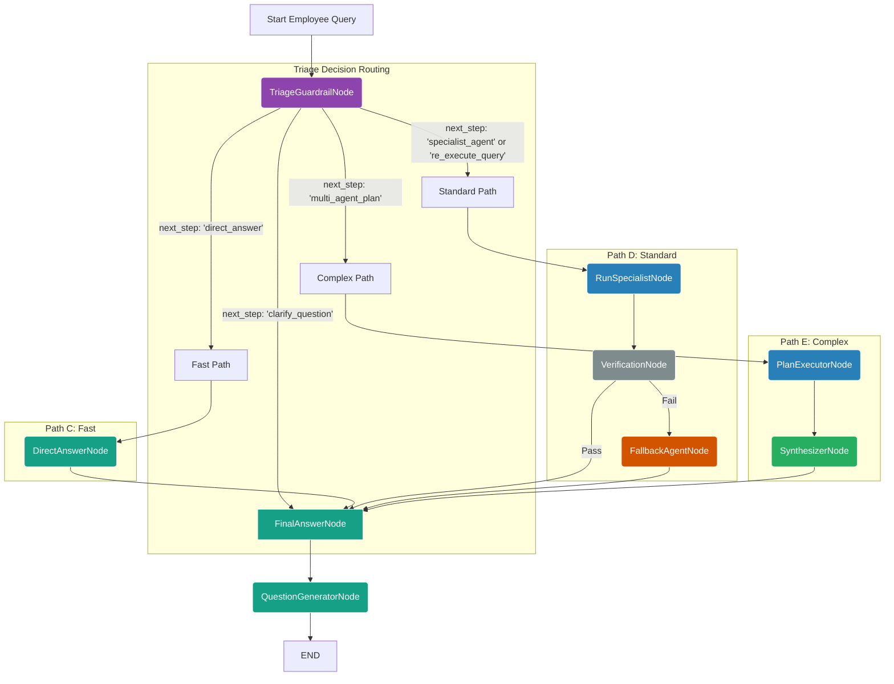

# EmployeeWorkflow - Secure Internal Agentic System

## Overview

The **EmployeeWorkflow** is a sophisticated, high-performance agentic workflow system designed specifically for internal employee use. Based on the optimized `employee_workflow.py`, this workflow successfully combines intelligent triage-based routing with adaptive execution paths, robust security features, and advanced **MCP (Model Context Protocol)** integration while maintaining strict data segregation to ensure customer data protection.

## Analysis of the Optimized Employee Workflow

This is a well-designed and robust implementation that successfully adapts the high-performance, adaptive pattern from the customer workflow to the specific needs and security requirements of an internal, employee-facing system.

### Key Strengths & Architectural Pillars

**1. Secure by Design (Data Segregation):**
This is the most critical aspect, and it has been handled correctly. The security model is multi-layered:
- **Initialization Firewall:** The `_initialize_agents` method acts as a strict firewall. By **not loading `CustomerAgent`** into the `self.agents` dictionary, it makes it impossible for the rest of the workflow to execute it, even if a later step were to fail or hallucinate.
- **Triage Context:** The `TriageGuardrailAgent` is configured with a prompt that only lists employee-available agents. This guides the primary planning step to stay within secure boundaries.
- **Runtime Validation:** The `_triage_node` includes a crucial secondary check: `if classified_agent and classified_agent not in self.agents:`. This is an excellent defense-in-depth measure. If the Triage LLM *were* to mistakenly suggest `CustomerAgent`, this code would catch it, log a security error, and route the query to a safe fallback path instead of attempting to execute the forbidden agent.
- **Role Hardcoding:** Methods like `arun_streaming_authenticated` correctly set `user_role="employee"`, ensuring that any downstream logic or tools that rely on this field operate in the correct, non-customer context.

**2. High Performance & Efficiency:**
The workflow is no longer a slow, linear chain. It is optimized for speed:
- **The Fast Path:** Simple queries like greetings ("Hello") are identified by the `TriageGuardrailAgent` and sent directly to the `DirectAnswerAgent`. This path involves only two lightweight LLM calls (`Triage` + `FinalAnswer`), resulting in near-instant responses.
- **Reduced LLM Calls:** For standard specialist queries ("How many vacation days do I have left?"), the old model might have involved 4-5 LLM calls (`Entry`, `Rewrite`, `Reflect`, `Supervisor`, etc.). The new model reduces this to a maximum of three (`Triage`, `Specialist`, `FinalAnswer`), significantly cutting down latency.
- **Efficient Correction:** The mandatory, slow `ReflectionAgent` loop is gone. It has been replaced by a much faster `VerificationNode` that acts as a quick quality check, only invoking the `FallbackAgent` when absolutely necessary.

**3. MCP Integration with Security:**
- **Employee-Specific MCP Tools:** Leverages Model Context Protocol for efficient, standardized data retrieval while maintaining employee access restrictions
- **Secure MCP Access:** Only employee-authorized MCP retrievers are available
- **Enhanced Performance:** MCP tools offer superior performance and reliability over traditional retrievers
- **Scalable Architecture:** MCP servers enable distributed, scalable knowledge retrieval for internal use

**4. Adaptive and Intelligent Routing:**
The `TriageGuardrailAgent` is the "brain" of the operation. It makes a single, powerful decision at the start, which dictates the entire flow. This is far more efficient than a series of smaller, sequential decision-making agents. The graph is built to execute the plan from this single decision, routing to the appropriate path:
- **Simple →** `DirectAnswerNode`
- **Standard →** `SpecialistNode` → `VerificationNode`
- **Complex →** `PlanExecutorNode` → `SynthesizerNode`
- **Ambiguous →** `FinalAnswerNode` (to format the clarification question)

**5. Resilience and User Experience:**
The workflow is designed to fail gracefully, which is crucial for maintaining employee trust in the system.
- **Verification & Fallback:** If a specialist agent (e.g., `EmployeeAgent`) fails or returns a poor answer, the `VerificationNode` catches it. Instead of showing an error, it routes to the `FallbackAgent`, which provides a helpful, general-purpose response. The employee is never left at a dead end.
- **Clarification:** If a query is ambiguous, the `TriageGuardrailAgent` can identify this and generate a clarifying question, which is then returned to the user, preventing the system from wasting time and resources processing a query it doesn't understand.

---

## Graph of the Optimized Employee Workflow

This Mermaid diagram visually represents the logical flow of the provided code. It shows the adaptive paths and decision points that make the workflow powerful and efficient.



## Core Components

### Node Architecture

| Node | Agent | Purpose | Input | Output |
|------|-------|---------|-------|---------|
| `triage_node` | `TriageGuardrailAgent` | Query classification, security checks, routing decisions | `original_query`, `chat_history`, `employee_context` | `classified_agent`, `next_step`, security validation |
| `direct_answer` | `DirectAnswerAgent` | Fast responses for simple queries and greetings | `original_query` | `agent_response` |
| `run_specialist` | Domain specialists | Execute domain-specific knowledge retrieval with employee context | `original_query`, `classified_agent`, `employee_id` | `agent_response`, `confidence_score` |
| `plan_executor` | Multiple specialists | Multi-agent coordination for complex employee queries | `original_query`, `agent_plan` | `agent_response` |
| `verification_node` | Built-in logic | Quality assurance, confidence validation, security checks | `agent_response`, `confidence_score` | `is_final_answer`, verification status |
| `fallback_agent` | `FallbackAgent` | Recovery responses for verification failures | `original_query`, `error_context` | `agent_response` |
| `synthesizer_node` | `SynthesizerAgent` | Aggregate and synthesize multi-agent results | Multiple agent responses | `synthesized_response` |
| `final_answer` | `FinalAnswerAgent` | Polish responses, format for streaming, add metadata | `agent_response`, `employee_context` | `final_response`, streaming events |
| `question_generator` | `QuestionGeneratorAgent` | Generate relevant follow-up questions | `agent_response`, `employee_history` | `suggested_questions` |

### Specialist Agents with MCP Tools (Secure Configuration)

| Agent | Purpose | Traditional Tools | MCP Tools | Employee Access | Security Level |
|-------|---------|------------------|-----------|-----------------|----------------|
| `EmployeeAgent` | Employee-specific services | Employee tools | `employee_retriever_mcp_tool` | All employees | Internal only |
| `CompanyAgent` | Company information retrieval | `company_retriever_tool` | `company_retriever_mcp_tool` | All employees | Public + Internal |
| `ProductAgent` | Product specifications and details | `product_retriever_tool` | `product_retriever_mcp_tool` | All employees | Public + Internal |
| `MedicalAgent` | Medical information and research | `medical_retriever_tool` | `medical_retriever_mcp_tool` | All employees | Public + Internal |
| `DrugAgent` | Drug information and interactions | `drug_retriever_tool` | `drug_retriever_mcp_tool` | All employees | Public + Internal |
| `GeneticAgent` | Genetic and genomic information | `genetic_retriever_tool` | `genetic_retriever_mcp_tool` | All employees | Public + Internal |
| `DirectAnswerAgent` | Simple responses | `searchweb_tool` | None | All employees | Public |
| `FallbackAgent` | Error recovery | `searchweb_tool`, `company_retriever_mcp_tool` | Multiple MCP tools | All employees | Safe fallback |

**Security Note:** `CustomerAgent` is **explicitly excluded** from the EmployeeWorkflow to ensure data segregation and prevent unauthorized access to customer-specific information.

### MCP (Model Context Protocol) Integration

The EmployeeWorkflow leverages advanced MCP integration for superior data retrieval while maintaining strict security boundaries:

#### MCP Retriever Factory

The workflow uses `MCPRetrieverFactory` for centralized MCP tool management:

```python
from app.agents.factory.mcp_retriever_factory import MCPRetrieverFactory

# Available MCP retriever types for employees (excluding customer-specific)
employee_mcp_types = {
    'employee': 'Employee-specific documents retriever',
    'company': 'Company documents and information retriever',
    'product': 'Product catalog and information retriever',
    'medical': 'Medical and healthcare information retriever',
    'drug': 'Drug and pharmacological information retriever',
    'genetic': 'Genetic and biomedical information retriever'
}
```

#### MCP Tool Configuration for Employees

Each MCP tool is configured with specific parameters and security boundaries:

| MCP Tool | Collection | Watch Directory | Description | Access Level |
|----------|------------|-----------------|-------------|--------------|
| `employee_retriever_mcp_tool` | `employee_docs` | `app/uploaded_files/documents` | Employee-specific documents | Employee only |
| `company_retriever_mcp_tool` | `company_knowledge` | `app/agents/retrievers/storages/companies` | Company documents and policies | Public + Internal |
| `product_retriever_mcp_tool` | `product_knowledge` | `app/agents/retrievers/storages/products` | Product specifications and catalogs | Public + Internal |
| `medical_retriever_mcp_tool` | `medical_docs` | `app/agents/retrievers/storages/medical_docs` | Medical research and guidelines | Public + Internal |
| `drug_retriever_mcp_tool` | `drug_knowledge` | `app/agents/retrievers/storages/drugs` | Drug information and interactions | Public + Internal |
| `genetic_retriever_mcp_tool` | `genetic_knowledge` | `app/agents/retrievers/storages/genetics` | Genetic and genomic data | Public + Internal |

#### MCP Server Configuration

```python
# Default MCP server configuration for employees
MCP_SERVER_URL = "http://localhost:50051/sse"

# MCP retriever initialization in agents (secure employee configuration)
{
    "EmployeeAgent": EmployeeAgent(llm=llm),  # Uses dynamic employee MCP tools
    "CompanyAgent": CompanyAgent(llm=llm, default_tool_names=["company_retriever_mcp_tool"]),
    "ProductAgent": ProductAgent(llm=llm, default_tool_names=["product_retriever_mcp_tool"]),
    "MedicalAgent": MedicalAgent(llm=llm, default_tool_names=["medical_retriever_mcp_tool"]),
    "DrugAgent": DrugAgent(llm=llm, default_tool_names=["drug_retriever_mcp_tool"]),
    "GeneticAgent": GeneticAgent(llm=llm, default_tool_names=["genetic_retriever_mcp_tool"]),
    # Note: CustomerAgent is explicitly excluded for security
}
```

### State Management

The workflow uses a comprehensive `GraphState` that tracks employee-specific information:

```python
class GraphState(TypedDict):
    # Core fields
    original_query: str
    rewritten_query: str
    classified_agent: Literal[...] 
    next_step: Optional[str]
    agent_response: str
    
    # Employee context (secure)
    employee_id: Optional[str]
    employee_role: Optional[str]
    department: Optional[str]
    access_level: Optional[str]
    
    # Workflow control
    is_multi_step: Optional[bool]
    should_re_execute: Optional[bool]
    is_final_answer: bool
    
    # Security and audit
    security_checks: Dict[str, Any]
    access_violations: List[str]
    audit_trail: List[Dict[str, Any]]
    
    # Metadata
    chat_history: List[Tuple[str, str]]
    suggested_questions: List[str]
    agent_thinks: Dict[str, Any]
    timestamp: Optional[str]
```

## Security Features

### Employee Role Access Matrix

| Employee Level | Internal Features | MCP Access | Restrictions |
|---------------|------------------|------------|--------------|
| `intern` | Basic search, public info, company policies | Standard MCP tools | No sensitive data access |
| `employee` | + Department resources, product info | + Department-specific MCP collections | Department data only |
| `senior_employee` | + Cross-department data, advanced search | + Senior MCP tools, multiple collections | Audit logging |
| `manager` | + Team data, reports, analytics | + Management MCP tools, team data | Team scope only |
| `admin` | Full internal access, system management | Full MCP access, management tools | Full audit logging |

### Data Segregation Validation

```python
def validate_employee_access(employee_role: str, requested_feature: str) -> bool:
    """Validate employee access with strict customer data exclusion."""
    employee_access_matrix = {
        "intern": ["basic_search", "company_info", "product_info"],
        "employee": ["basic_search", "company_info", "product_info", "department_data"],
        "senior_employee": ["basic_search", "company_info", "product_info", "department_data", "cross_department"],
        "manager": ["basic_search", "company_info", "product_info", "department_data", "cross_department", "team_management"],
        "admin": ["all_internal_features"]  # Note: excludes customer data
    }
    
    # Explicitly forbidden features for all employees
    forbidden_features = ["customer_data", "customer_retriever", "personal_customer_info"]
    
    if requested_feature in forbidden_features:
        return False
    
    allowed_features = employee_access_matrix.get(employee_role, [])
    return requested_feature in allowed_features or "all_internal_features" in allowed_features
```

### Security Checkpoints

The workflow includes multiple security checkpoints:

1. **Entry Security**: Employee authentication and role validation
2. **Agent Whitelist**: Only employee-safe agents are accessible
3. **Customer Data Firewall**: Explicit blocking of customer data access
4. **MCP Security**: Employee-specific MCP tool restrictions
5. **Audit Logging**: Complete activity tracking for compliance

## Features

### 1. Intelligent Routing with Security

The `TriageGuardrailAgent` analyzes each query and determines:
- **Query Classification**: Which specialist agent should handle the query
- **Security Validation**: Ensures query doesn't attempt customer data access
- **Complexity Assessment**: Whether multi-agent coordination is needed
- **Processing Path**: Fast path, standard path, or multi-agent path
- **Employee Authorization**: Validates employee access to requested resources

### 2. MCP-Enhanced Tool System with Security

**Employee-Specific MCP Configuration:**
- **Secure MCP Tools**: Only employee-authorized MCP retrievers available
- **Data Segregation**: Customer-specific MCP tools explicitly excluded
- **Performance**: MCP tools provide better scalability and resource management
- **Standardization**: Consistent interface across all internal data sources

**Tool Factory Integration for Employees:**
```python
from app.agents.factory.factory_tools import TOOL_FACTORY

# Get employee-safe static MCP tools
company_mcp = TOOL_FACTORY.get_static_tool("company_retriever_mcp_tool")
drug_mcp = TOOL_FACTORY.get_static_tool("drug_retriever_mcp_tool")

# Get dynamic employee-specific MCP tools
employee_mcp = TOOL_FACTORY.get_dynamic_tool("employee_retriever_mcp_tool", state)

# Create custom employee MCP tools (with security validation)
custom_mcp = TOOL_FACTORY.get_mcp_tool("genetic", collection_name="internal_genetics")
```

### 3. Robust Error Handling with Security

- **Triage Failures**: Automatic fallback to safe defaults
- **Agent Errors**: Verification step catches poor responses
- **Security Violations**: Immediate blocking and audit logging
- **MCP Connection Issues**: Graceful degradation to traditional tools
- **Routing Issues**: Recovery based on available state information
- **Customer Data Attempts**: Explicit blocking with security alerts

### 4. Enhanced Streaming

Real-time response streaming with support for:
- **Answer Chunks**: Progressive response building
- **Node Progress**: Workflow step notifications
- **Security Events**: Access validation notifications
- **MCP Events**: Tool execution progress
- **Audit Events**: Security and compliance logging
- **Error Events**: Graceful error communication
- **Metadata**: Rich contextual information

### 5. Employee Context Awareness

- **Role-based Access**: Different capabilities for employee levels
- **Department Context**: Department-specific data access
- **Session Management**: Persistent conversation context
- **Audit Tracking**: Complete activity logging for compliance
- **Privacy Controls**: Employee data protection (separate from customers)

## Usage

### Basic Employee Usage

```python
from app.agents.workflow.employee_workflow import EmployeeWorkflow

# Initialize workflow
workflow = EmployeeWorkflow()

# Simple streaming execution for employees
async for event in workflow.arun_streaming("What are our company policies on remote work?"):
    if event['event'] == 'node_start':
        print(f"Starting: {event['data']['node']}")
    elif event['event'] == 'security_check':
        print(f"Security validation: {event['data']['status']}")
    elif event['event'] == 'answer_chunk':
        print(event['data'], end="", flush=True)
    elif event['event'] == 'final_result':
        print(f"\nSuggested: {event['data']['suggested_questions']}")
```

### Authenticated Employee Usage with MCP

```python
import uuid
from datetime import datetime

# Enhanced authenticated streaming with MCP support for employees
config = {
    "configurable": {
        "thread_id": f"employee_session_{datetime.utcnow().timestamp()}"
    }
}

async for event in workflow.arun_streaming_authenticated(
    query="I need information about our product development pipeline",
    config=config,
    employee_id="emp_12345",
    employee_role="senior_employee",
    interaction_id=uuid.uuid4(),
    chat_history=[
        {"role": "user", "content": "Hello"},
        {"role": "assistant", "content": "Hi! How can I help you with internal resources today?"}
    ]
):
    # Handle streaming events
    if event['event'] == 'mcp_tool_start':
        print(f"Using employee MCP tool: {event['data']['tool_name']}")
    elif event['event'] == 'security_validation':
        print(f"Security status: {event['data']['status']}")
    elif event['event'] == 'final_result':
        result = event['data']
        print(f"Response: {result['agent_response']}")
        print(f"Security compliant: {result['security_compliant']}")
```

### Employee MCP Tool Management

```python
from app.agents.factory.mcp_retriever_factory import MCP_RETRIEVER_MANAGER

# List active employee MCP retrievers
active_retrievers = MCP_RETRIEVER_MANAGER.list_retrievers()
employee_retrievers = {k: v for k, v in active_retrievers.items() if 'customer' not in k}
print(f"Employee MCP retrievers: {employee_retrievers}")

# Create and register new employee MCP retriever
employee_retriever = MCP_RETRIEVER_MANAGER.create_and_register(
    name="department_docs",
    retriever_type="employee",
    employee_id="emp_12345",
    department="engineering"
)

# Cleanup resources when done
MCP_RETRIEVER_MANAGER.cleanup_all()
```

### Session Management

```python
# Create employee workflow session
session_id = await create_employee_workflow_session(
    employee_id="emp_12345",
    employee_role="employee"
)

# Validate employee access (with customer data protection)
has_access = validate_employee_access(
    employee_role="senior_employee",
    requested_feature="department_data"
)

# This should always return False for security
customer_access = validate_employee_access(
    employee_role="admin",
    requested_feature="customer_data"  # Always forbidden
)
```

## Configuration

### Employee Role Access Matrix

| Role | Internal Features | MCP Access | Data Scope |
|------|------------------|------------|------------|
| `intern` | Basic search, company info, product info | Standard MCP tools | Public data only |
| `employee` | + Department resources, product development | + Department MCP collections | Department data |
| `senior_employee` | + Cross-department, advanced analysis | + Senior MCP tools, multiple collections | Multi-department |
| `manager` | + Team management, reports, analytics | + Management MCP tools, team data | Team + department |
| `admin` | Full internal access, system management | Full internal MCP access | All internal data |

### MCP Server Configuration for Employees

```bash
# Employee MCP Server Configuration
MCP_SERVER_URL=http://localhost:50051/sse
MCP_SERVER_TIMEOUT=30
MCP_SERVER_RETRY_ATTEMPTS=3

# Employee MCP Collection Settings (excluding customer collections)
COMPANY_DB=company_knowledge
EMPLOYEE_DB=employee_docs
PRODUCT_DB=product_knowledge
MEDICAL_DB=medical_docs
DRUGS_DB=drug_knowledge
GENETIC_DB=genetic_knowledge

# Customer collections are explicitly excluded for security
# CUSTOMER_DB=customer_docs  # NOT AVAILABLE TO EMPLOYEES
```

### Environment Variables

```bash
# LLM Configuration
LLM_PROVIDER=vllm  # or ollama
LLM_MODEL=your-model-name
VLLM_API_URL=http://localhost:6622/v1

# Reasoning LLM (for complex analysis)
REASONING_LLM_PROVIDER=vllm
LLM_REASONING_MODEL=your-reasoning-model

# Database and Caching
ENABLE_CACHING=true
CACHE_TTL=1800  # 30 minutes

# MCP Integration for Employees
ENABLE_MCP_TOOLS=true
MCP_FALLBACK_TO_TRADITIONAL=true
EMPLOYEE_MCP_SECURITY=strict

# Security and Audit
ENABLE_AUDIT_LOGGING=true
CUSTOMER_DATA_ACCESS_BLOCKED=true
SECURITY_VIOLATION_ALERTS=true
```

## Event Types

### Streaming Events

| Event Type | Description | Data |
|------------|-------------|------|
| `node_start` | Workflow node begins execution | `{node: string}` |
| `answer_chunk` | Partial response content | `{response_text: string}` |
| `security_check` | Security validation performed | `{status: string, validation_type: string}` |
| `mcp_tool_start` | Employee MCP tool execution begins | `{tool_name: string, tool_type: string}` |
| `mcp_tool_complete` | Employee MCP tool execution complete | `{tool_name: string, result_count: number}` |
| `security_validation` | Access control validation | `{status: string, employee_role: string}` |
| `audit_log` | Security audit event | `{event_type: string, employee_id: string, timestamp: string}` |
| `final_result` | Complete workflow result | `{agent_response, suggested_questions, security_compliant, metadata}` |
| `error` | Error occurred | `{error: string, node?: string, security_related?: boolean}` |

## License

This workflow is part of the Agentic GeneStory Platform and follows the project's licensing terms.

---

**Last Updated**: September 3, 2025  
**Version**: 3.0.0  
**Compatibility**: Python 3.8+, LangChain 0.1+, LangGraph 0.1+, MCP Protocol 1.0+  
**Security Level**: Internal Employee Use Only - Customer Data Protection Enforced