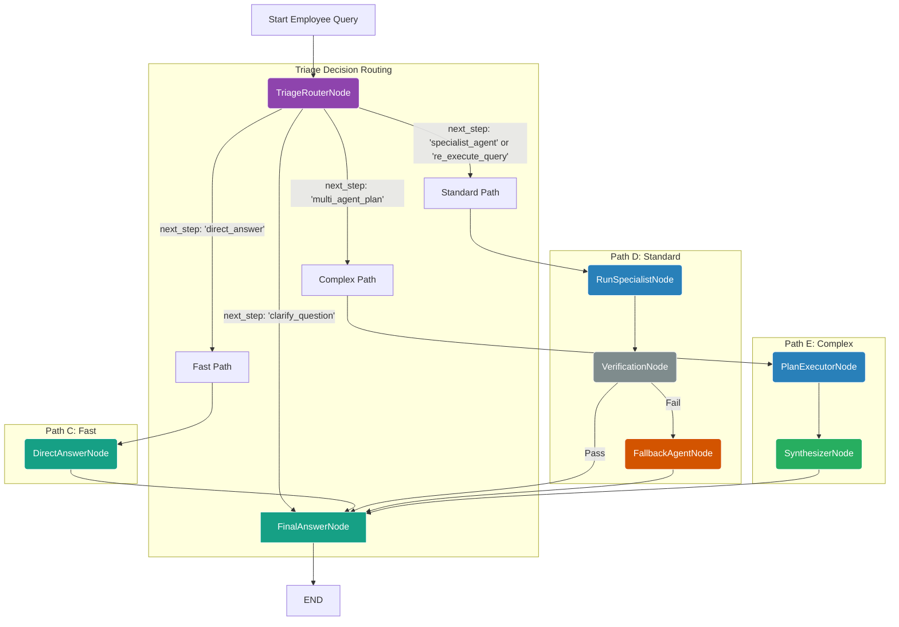

Excellent. Based on the provided `employee_workflow_optimized.py`, here is a detailed analysis and a visual graph representation of the new, powerful architecture.

### Analysis of the Optimized Employee Workflow

This is a well-designed and robust implementation that successfully adapts the high-performance, adaptive pattern from the customer workflow to the specific needs and security requirements of an internal, employee-facing system.

**Key Strengths & Architectural Pillars:**

**1. Secure by Design (Data Segregation):**
This is the most critical aspect, and it has been handled correctly. The security model is multi-layered:
*   **Initialization Firewall:** The `_initialize_agents` method acts as a strict firewall. By **not loading `CustomerAgent`** into the `self.agents` dictionary, it makes it impossible for the rest of the workflow to execute it, even if a later step were to fail or hallucinate.
*   **Triage Context:** The `TriageRouterAgent` should be (and is designed to be) configured with a prompt that only lists employee-available agents. This guides the primary planning step to stay within secure boundaries.
*   **Runtime Validation:** The `_triage_node` includes a crucial secondary check: `if classified_agent and classified_agent not in self.agents:`. This is an excellent defense-in-depth measure. If the Triage LLM *were* to mistakenly suggest `CustomerAgent`, this code would catch it, log a security error, and route the query to a safe fallback path instead of attempting to execute the forbidden agent.
*   **Role Hardcoding:** Methods like `arun_streaming_authenticated` correctly set `user_role="employee"`, ensuring that any downstream logic or tools that rely on this field operate in the correct, non-customer context.

**2. High Performance & Efficiency:**
The workflow is no longer a slow, linear chain. It is optimized for speed:
*   **The Fast Path:** Simple queries like greetings ("Hello") are identified by the `TriageRouterAgent` and sent directly to the `DirectAnswerAgent`. This path involves only two lightweight LLM calls (`Triage` + `FinalAnswer`), resulting in near-instant responses.
*   **Reduced LLM Calls:** For standard specialist queries ("How many vacation days do I have left?"), the old model might have involved 4-5 LLM calls (`Entry`, `Rewrite`, `Reflect`, `Supervisor`, etc.). The new model reduces this to a maximum of three (`Triage`, `Specialist`, `FinalAnswer`), significantly cutting down latency.
*   **Efficient Correction:** The mandatory, slow `ReflectionAgent` loop is gone. It has been replaced by a much faster `VerificationNode` that acts as a quick quality check, only invoking the `FallbackAgent` when absolutely necessary.

**3. Adaptive and Intelligent Routing:**
The `TriageRouterAgent` is the "brain" of the operation. It makes a single, powerful decision at the start, which dictates the entire flow. This is far more efficient than a series of smaller, sequential decision-making agents. The graph is built to execute the plan from this single decision, routing to the appropriate path:
*   **Simple ->** `DirectAnswerNode`
*   **Standard ->** `SpecialistNode` -> `VerificationNode`
*   **Complex ->** `PlanExecutorNode` -> `SynthesizerNode`
*   **Ambiguous ->** `FinalAnswerNode` (to format the clarification question)

**4. Resilience and User Experience:**
The workflow is designed to fail gracefully, which is crucial for maintaining employee trust in the system.
*   **Verification & Fallback:** If a specialist agent (e.g., `EmployeeAgent`) fails or returns a poor answer, the `VerificationNode` catches it. Instead of showing an error, it routes to the `FallbackAgent`, which provides a helpful, general-purpose response. The employee is never left at a dead end.
*   **Clarification:** If a query is ambiguous, the `TriageRouterAgent` can identify this and generate a clarifying question, which is then returned to the user, preventing the system from wasting time and resources processing a query it doesn't understand.

---

### Graph of the Optimized Employee Workflow

This Mermaid diagram visually represents the logical flow of the provided code. It shows the adaptive paths and decision points that make the workflow powerful and efficient.

