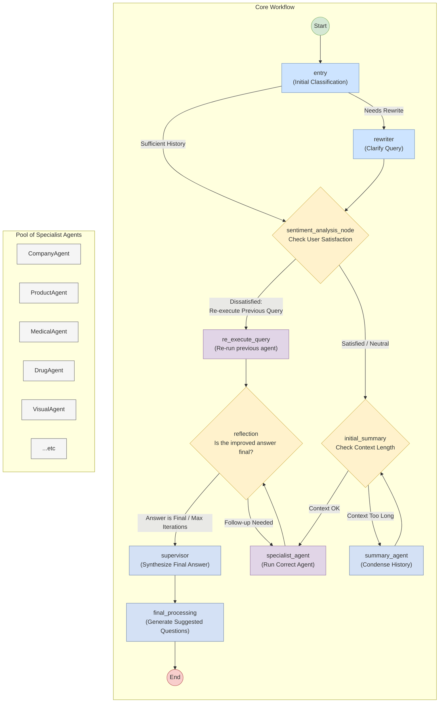

Of course. Here is the analysis and the GraphTD diagram with added colors to distinguish the different types of nodes in the workflow.

### Analysis of the Customer Workflow System

The provided Python script defines a sophisticated, multi-agent conversational workflow using the `langgraph` library. The system, encapsulated in the `CustomerWorkflow` class, is designed to handle customer queries in a robust and intelligent manner. Its core architecture is a state graph where different specialized agents are invoked as nodes based on the evolving state of the conversation.

The most significant feature of this "enhanced" workflow is the integration of **sentiment analysis**. This allows the system to gauge user satisfaction with previous answers and dynamically alter its behavior, creating a self-correcting feedback loop.

---

### Key Components

*   **State Management (`AgentState`)**: A central data structure that holds all information relevant to the current interaction. This includes the original query, chat history, agent responses, customer details, and the results from the sentiment analysis.

*   **Agent Initialization (`_initialize_agents`)**: The system pre-loads a suite of specialized agents, each with a specific role:
    *   **Core/Orchestration Agents**: `entry`, `rewriter`, `reflection`, `supervisor`, `question_generator`, `summary_agent`. These agents manage the flow of the conversation.
    *   **Sentiment Agent**: `sentiment_analysis_agent` is the key new component responsible for understanding user satisfaction.
    *   **Specialist Agents**: A collection of agents for specific domains like `CompanyAgent`, `ProductAgent`, `MedicalAgent`, etc., which handle the core task of answering the user's query.

*   **Graph Definition (`_build_and_compile_graph`)**: This is the heart of the workflow. It defines the nodes (agents) and the conditional edges (routing logic) that determine the sequence of operations.

---

### Step-by-Step Workflow Execution

The workflow processes a user query through a series of steps, with routing decisions made at critical junctures.

1.  **Entry & Pre-processing (`entry`, `rewriter`)**:
    *   The workflow begins at the `entry` node, which performs an initial classification of the query.
    *   It immediately checks the chat history. If there are at least two previous interactions, it routes the query to the sentiment analysis path to check for user satisfaction.
    *   If the query is ambiguous, it can be passed to the `rewriter` node for clarification before proceeding.

2.  **Sentiment Analysis & Re-Execution (`sentiment_analysis_node`, `re_execute_query`)**:
    *   This is the new, critical feedback loop. The `sentiment_analysis_node` analyzes the user's latest message to determine their intent (e.g., positive, negative) and whether they are dissatisfied with a previous answer.
    *   **Conditional Routing**:
        *   If the user is deemed dissatisfied and their query is similar to the previous one (`should_re_execute` is True), the workflow branches to the `re_execute_query` node. This node re-runs the previous agent, aiming to provide a better, more detailed answer.
        *   If the user is satisfied or asking a new question, the workflow proceeds to the normal processing path.

3.  **Context Summarization (`initial_summary`)**:
    *   Before invoking a specialist, the system checks if the chat history is too long. If it exceeds a threshold, the `SummaryAgent` is called to condense the context. This step can loop back on itself if the summary is still too long.

4.  **Specialist Agent Execution (`specialist_agent`)**:
    *   Based on the query's classification, the appropriate specialist agent (e.g., `ProductAgent`, `MedicalAgent`) is executed by the `_run_agent` method. This node performs the primary work of answering the query using its specialized tools and knowledge.

5.  **Reflection and Refinement Loop (`reflection`)**:
    *   After a specialist agent generates a response, the `reflection` node assesses its quality and completeness.
    *   **Conditional Routing**:
        *   If the answer is deemed final or the maximum number of iterations has been reached, the flow proceeds to the `supervisor`.
        *   If the answer is incomplete, the `ReflectionAgent` can suggest a follow-up with another specialist agent, looping the process back to the `specialist_agent` node. This creates a powerful multi-step reasoning capability.

6.  **Finalization (`supervisor`, `final_processing`)**:
    *   The `supervisor` node takes the final agent response and synthesizes it into a polished, user-facing answer.
    *   The `final_processing` node then runs a `QuestionGeneratorAgent` to create suggested follow-up questions. It also packages the sentiment analysis results into the final output.
    *   The workflow concludes by reaching the `END` state.

---

### GraphTD Representation

This GraphTD diagram visualizes the workflow. Colors are used to group related functions:
*   **Blue**: Entry and Pre-processing.
*   **Yellow**: Conditional routing and decision points.
*   **Purple**: Core agent execution steps.
*   **Teal**: Utility and finalization steps.
*   **Green/Red**: Start and End points.

